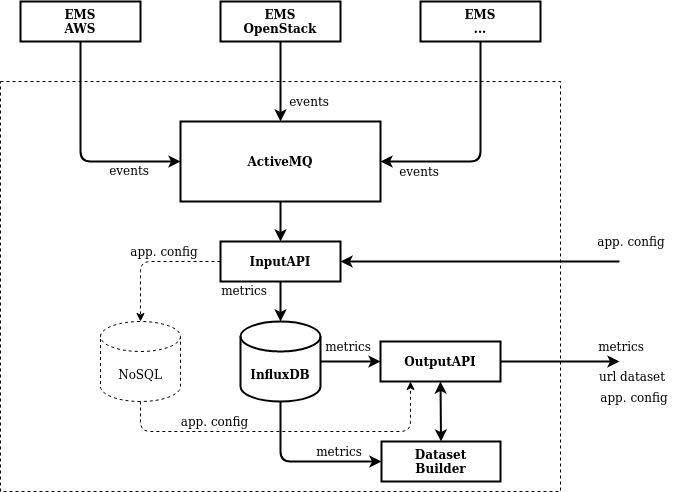

# Persistent Storage Module
This module is responsible for storing application component metrics into an isolated and secure database. Low-overhead APIs have been implemented to support mission-specific read and write queries.

## Overview

The following components are being defined in action flow order:
1. The ActiveMQ message queue receives metric values from EMS instances and forwards them to the InputAPI.
1. The InputAPI appends current deployment configuration metadata from the metamodel to the metric values, and stores them into the InfluxDB instance.
1. The InfluxDB instance stores each record following the line protocol. Each line represents a point in time for a component's configuration (`tag_fields`) and it's current state (`value_fields`).
1. The OutputAPI has two main functionalities:

	- It listens for InfluxDB queries as HTTP requests from external Forecasting Module components and acts as a reverse proxy for the database, which returns a series of real time metric values.
	- It listens for HTTP requests from the Trainer component of the Performance Modeling module and act as reverse proxy for the Dataset Builder, which returns a dataset URL.

## Get Started
The Persistent Storage Module is implemented as a network isolated docker service stack. The `docker-compose.yml` file sets up the following containers:
- ActiveMQ Container Instance (exposed)
- InputAPI Container Instance (internal)
	- **Requirements**: `METAMODEL_URL` to Metamodel instance endpoint for requesting deployed application configuration data.
- InfluxDB Container Instance (internal)
- **[In progress]** Dataset Builder Container Instance (internal)
- OutputAPI Container Instance (exposed)
- **[Optional]** Grafana Container Instance (exposed - *for dev visualisation*)